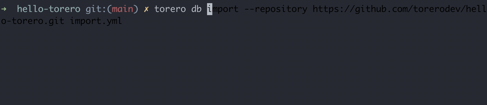
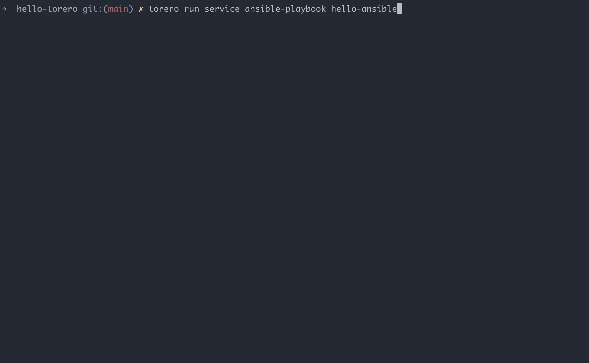

## Summary
To make your first [torero](https://torero.dev) experience as easy as possible, let's start by saying **hello** to the **world**! Today, torero supports Ansible, Python, and OpenTOFU. This _repository_ contains the code and instructions for importing and running each _hello world_ example into a fresh install of torero as individual services.

## Before you get started
Follow the instructions at [https://docs.torero.dev/en/latest/installation/#pre-requisites](https://docs.torero.dev/en/latest/installation/#pre-requisites) to install torero if you haven't already. Installation is a breeze -- torero is distributed as a single binary and can be installed on Mac OS or any Debian + RHEL based distro in seconds.

> [!NOTE]
> Take it for a spin and let us know what you think! We value your time and feedback. You can connect with us directly in the [Network Automation Forum (NAF) Slack Workspace](https://networkautomationfrm.slack.com/?redir=%2Farchives%2FC075L2LR3HU%3Fname%3DC075L2LR3HU) in the **#tools-torero** channel.

## Getting Started
To import all of the services contained in this repository, we can use the [db import](https://docs.torero.dev/en/latest/cli/torero_db_import/) command with the **repository** argument _(to reference the public git repository)_ and provide the name of the file to import from - **import.yml**.

```bash
torero db import --repository https://github.com/torerodev/hello-torero.git import.yml
```



## Viewing Repositories and Services
To view the repository and services that were imported, we can use the [get repositories](https://docs.torero.dev/en/latest/cli/torero_get_repositories/) and [get services](https://docs.torero.dev/en/latest/cli/torero_get_services/) commands.

```bash
torero get repositories \
  && torero get services
```


> [!TIP]
> To view all details about these resources, use [describe repository](https://docs.torero.dev/en/latest/cli/torero_describe_repository/) and [describe service](https://docs.torero.dev/en/latest/cli/torero_describe_service/)
> ```bash
> torero describe repository hello-torero \
>   && torero describe service hello-ansible
> ```

## Running Services
Let's run the services we imported using [run service](https://docs.torero.dev/en/latest/cli/torero_run_service/) along with the _service-type_ and _service-name_.

```bash
torero run service ansible-playbook hello-ansible \
  && torero run service python-script hello-python \
  && torero run service opentofu-plan apply hello-opentofu
```

